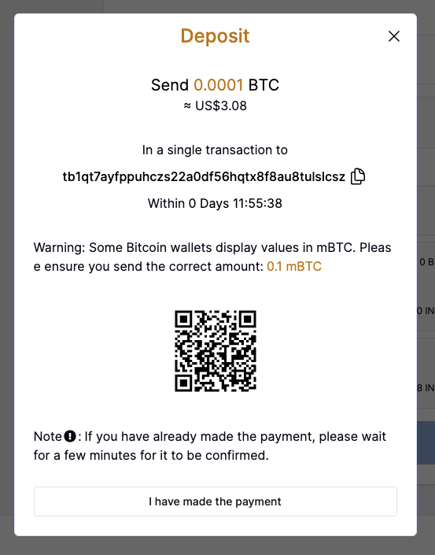
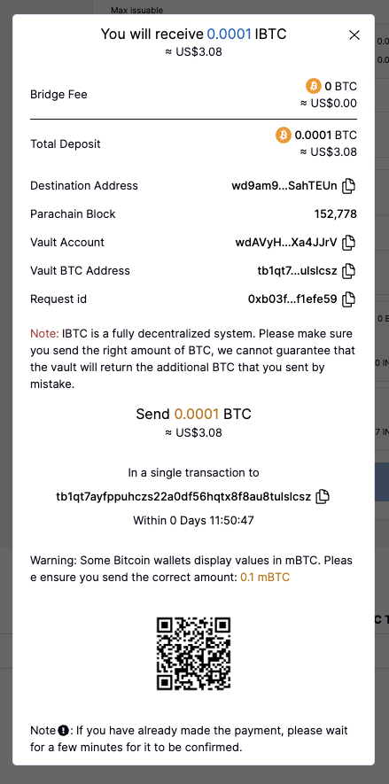
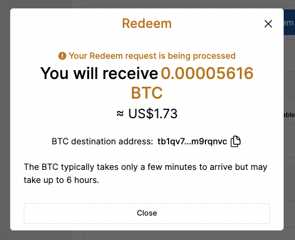
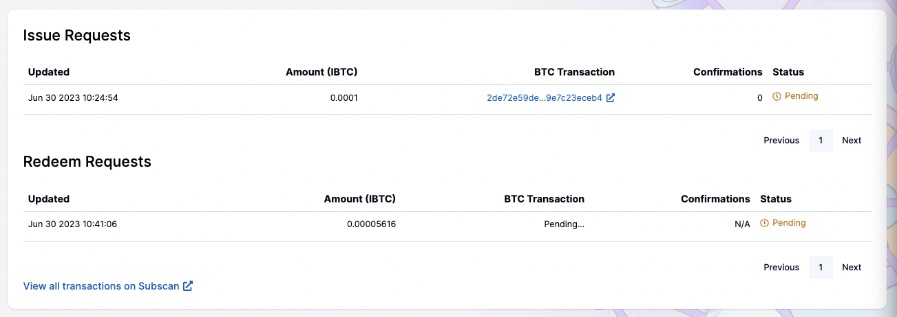

# IBTC/KBTC Bridge Guide

## Issue

IBTC and KBTC allows you to receive a representation of BTC to be used any way you see fit in the Polkadot and Kusama ecosystems.
To get you started, follow this guide.

At the end of this guide you will have:

- [x] [Requested to mint IBTC/KBTC on the Interlay/Kintsugi parachain](#_3-enter-the-amount-of-btc-you-want-to-bridge-to-polkadotkusama)
- [x] [Sent BTC to a Vault on the Bitcoin blockchain](#_4-transfer-btc-from-your-bitcoin-wallet-to-the-vault-address)
- [x] [Received IBTC/KBTC on the Interlay/Kintsugi parachain](#_5-wait-for-confirmation-of-your-btc-transaction-and-receive-kbtcinterbtc-automatically)

### Prerequisites

Make sure you have the required [polkadot-js extension and a Bitcoin wallet](guides/wallets-explorers.md).

### Issue IBTC/KBTC

#### 1. Go to the bridge page.

<!-- tabs:start -->

##### **Interlay**

[app.interlay.io/btc](https://app.interlay.io/btc)

##### **Kintsugi**

[kintsugi.interlay.io/btc](https://kintsugi.interlay.io/btc)

##### **Testnet-Kintsugi**

[testnet.interlay.io/bridge](https://kintnet.interlay.io/bridge)

##### **Testnet-Interlay**

[testnet.interlay.io/bridge](https://testnet.interlay.io/bridge)

<!-- tabs:end -->

The bridge has 2 tabs: Issue and Redeem. Ensure you are on the Issue tab.

#### 2. Obtain KINT/INTR to pay the transaction fees.

You will need some of the native on-chain currency (KINT on Kintsugi, INTR on Interlay) to pay the transaction fee. Additionally, to prevent spam, you will need to place a small deposit which will be returned to you once the request has been completed.

<!-- tabs:start -->

##### **Interlay**

A list of exchanges with INTR listings can be found on [Coingecko](https://www.coingecko.com/en/coins/interlay).

##### **Kintsugi**

A list of exchanges with KINT listings can be found on [Coingecko](https://www.coingecko.com/en/coins/kintsugi).

##### **Testnet**

On testnet, you can obtain some test KINT/INTR by clicking on the "KINT/INTR Faucet" button on the right-hand side of the top bar.

<!-- tabs:end -->

#### 3. Enter the amount of BTC you want to bridge to Interlay/Kintsugi

Enter the amount of KBTC or IBTC you want to issue. The app will automatically select a Vault for you.

Check the details of your issue request and click **"Confirm"**. Sign the transaction via the `polkadot-js` extension when asked and wait a few moments.

#### 4. Transfer BTC from your Bitcoin wallet to the Vault address

!> Make sure you send the exact amount of BTC. Note that some exchanges or other platforms might deduct fees when you send BTC. Please make sure to double check the Bitcoin transaction to ensure it has the correct amount. If you realize that you send less BTC than requested, make sure to manually execute the issue request **within 24 hours** as described [in the manual execution instruction](#_6-manually-claim-your-kbtcibtc).

Use your Bitcoin wallet to transfer the specified `amount` to the given `address`.

You can find your issue request in the table below the issue form.

Find your pending issue request in the **"Issue Requests"** table and click on it. There you will find the details of the Bitcoin transaction you need to make.

?> Optional: you can use a hardware wallet

<b>Send BTC with the Ledger wallet</b>

<!-- tabs:start -->
##### **Interlay/Kintsugi**
On mainnet, no setup for [Ledger Live](https://www.ledger.com/ledger-live) is needed.

##### **Testnet**

On testnet, you will need to configure [Ledger Live](https://www.ledger.com/ledger-live) to work with Bitcoin testnet. Go to `Setting` > `Experimental features` and enable `Developer mode`. Using the `Manager`, install the `Bitcoin testnet` app onto your device.

<!-- tabs:end -->

Enter the recipient address or scan the QR code. ([Support](https://support.ledger.com/hc/en-us/articles/360019123593-Send-crypto-assets))

Enter the amount - this may be auto-completed.

Review the summary and click **"Continue"**.

Confirm the recipient address, amount and fees on the device.

The receipt will show the transaction ID, click **"View in explorer"** to check whether your transaction is included in the Bitcoin network.

<b>Send BTC with the Trezor wallet</b>

<!-- tabs:start -->

##### **Interlay/Kintsugi**

On mainnet, no setup for the [Trezor Wallet](https://wallet.trezor.io/#/) is needed.

##### **Testnet**

On testnet, you will need to configure the [Trezor Wallet](https://wallet.trezor.io/#/) to work with Bitcoin testnet. go to the `Wallet Settings` and set `Backend Server URL` to `https://tbtc2.trezor.io`.

For up-to-date details please checkout the [Trezor Wiki](https://wiki.trezor.io/Bitcoin_testnet).

<!-- tabs:end -->

Enter the recipient address and amount manually or scan the QR code. ([User Manual](https://wiki.trezor.io/User_manual:Making_payments#Enter_the_destination_address_and_the_amount))

Confirm the recipient address, amount and fees on the device.

The payment will appear in the `Transactions` tab as unconfirmed. Once this is included in the Bitcoin network the status should update.
If configured, you may also check the status of the transaction in a block explorer.

#### 5. Wait for confirmation of your BTC transaction and receive IBTC/KBTC automatically

Once you've made the payment, the app will automatically locate your transaction on the Bitcoin blockchain. If this transaction is correct, you can wait for a few minutes and you will receive your IBTC: a Vault will eventually execute your request once your transaction has sufficient confirmations.

**I've accidentally sent more BTC than required**

If you sent more BTC than was necessary, one of two things will happen.

1. If the vault had sufficient capacity to accomodate your larger request, it will be executed automatically, and no further action on your part is required.
2. If the vault does not have sufficient capacity, then a **Refund request** will be automatically created, giving the vault the option to return the excess BTC to you. However, since IBTC is a decentralized system, there is no way to ensure that the vault fulfils this.

**I've accidentally sent less BTC than required**

If you accidentally sent less BTC than was necessary, then automatic execution is disabled for security reasons.

!> In this case, you will have to execute your request manually within 24 hours. Otherwise, your BTC will be lost.

You also have the options to try again to send the correct amount. Note that multiple transactions can **not** be used with a single issue request - the funds from the first transaction **will be lost**. This is useful if you accidentally sent a trace amount of Bitcoin (such as only a few Satoshi), and would rather forfeit that than have to create a new issue request.

#### 6. Manually claim your IBTC/KBTC

You can check the status of your issue request in the Transactions view in the **"Issue Requests"** table as [described above](#_4-transfer-btc-from-your-bitcoin-wallet-to-the-vault-address).

If your Bitcoin transaction has enough confirmations but has not been executed by a Vault yet, click on the issue request that is "Pending". This will open a modal, where you will see a **"Claim KBTC"** (or **"Claim IBTC"**) button. To finalize the Issue process and claim your IBTC/KBTC, either wait for a Vault to auto-execute your request, or click **"Claim"** yourself.

## Redeem

KBTC or IBTC can be redeemed at any point in time for BTC on the Bitcoin blockchain. To receive BTC for your existing IBTC/KBTC, follow this guide.

At the end of this guide you will have:

- [x] [Requested to redeem your IBTC/KBTC on the Interlay/Kintsugi parachain](#_2-enter-the-amount-of-kbtcinterbtc-you-want-to-redeem-and-the-btc-address-you-want-to-receive-your-btc-to)
- [x] [Received BTC on the Bitcoin blockchain](#_3-wait-for-confirmation-of-your-request-and-receive-btc-automatically)
- [x] [Optionally: retried to redeem IBTC/KBTC with another Vault](#retry)
- [x] [Optionally: reimbursed IBTC/KBTC for KSM/DOT](#reimburse)

### Prerequisites

- Make sure you have the required [polkadot-js extension and a Bitcoin wallet](guides/wallets-explorers.md).
- Make sure you [have KBTC or IBTC in your wallet](#issue)
- Make sure you [have KINT/INTR to pay for transaction fees](#_2-obtain-kintintr-to-pay-the-transaction-fees)

### Redeem IBTC/KBTC

#### 1. Go to the bridge page.

<!-- tabs:start -->

##### **Interlay**

[app.interlay.io/btc](https://app.interlay.io/btc)

##### **Kintsugi**

[kintsugi.interlay.io/btc](https://kintsugi.interlay.io/btc)

##### **Testnet-Kintsugi**

[kintnet.interlay.io/bridge](https://kintnet.interlay.io/bridge)

##### **Testnet-Interlay**

[testnet.interlay.io/bridge](https://testnet.interlay.io/bridge)

<!-- tabs:end -->

The bridge has 2 tabs: Issue and Redeem. Ensure you are on the Redeem tab.

#### 2. Enter the amount of IBTC/KBTC you want to redeem and the BTC address you want to receive your BTC to

Enter the amount of IBTC/KBTC you want to redeem, and the Bitcoin address where you want to receive the redeemed Bitcoin amount. Supported address types are: [P2SH](https://en.bitcoin.it/wiki/P2SH), [P2PKH](https://en.bitcoin.it/wiki/P2PKH) and [P2WPKH](https://wiki.trezor.io/P2WPKH).

Check the bridge fee that is subtracted from your redeemed amount and click **"Confirm"**. Sign the transaction via the `polkadot-js` extension when asked and wait a few moments.

#### 3. Wait for confirmation of your request and receive BTC automatically

The Redeem request is now being processed by the Vault. On testnet, the request will take approx. 20 minutes and on the Kintsugi and Interlay networks, the request will take at least 1 hour. Vaults have 24 hours to complete the request in total. After this, you will receive your Bitcoin at the address you specified.

If the Vault does not fulfil the request within 24 hours, you have the option to either reimburse your BTC or retry your request; see below.

#### 4. Optional: Retry or Reimburse your request

You can check the status of your redeem request below the redeem form.

Vaults have 24 hours to complete your request. If it is not completed in time, you have the option to either Reimubse or Retry.

##### Reimburse

Reimbursing a redeem request that hasn't been fulfilled in time means accepting a payout in the Vault's collateral currency instead of BTC. The Vault's collateral will be slashed to the value equivalent to the BTC amount in the redeem request, plus a convenience fee. Your IBTC/KBTC will then be redeemed for this amount of collateral, rather than BTC.

Click on the redeem request that is "Pending". This will open a modal, where you will see a **"Reimburse"** button if the request has been open for more than 24 hours. Click on it to reimburse your request, forfeiting your BTC and receiving a greater value in collateral in return.

##### Retry

If you wish to receive BTC directly rather than any collateral currency, then you have the option to cancel the redeem request, which will give you the opportunity to open a new one. The Vault will be slashed a percentage of the request for failing to fulfil it in time, which will be transferred to you as a convenience fee; otherwise, you will retain ownership of your IBTC/KBTC and will need to open a new redeem request if you still wish to redeem for BTC.

Click on the redeem request that is "Pending". This will open a modal, where you will see a **"Retry"** button if the request has been open for more than 24 hours. Click on it to cancel your request, receiving a percentage in collateral as a convenience fee and allowing you to open a new redeem request for your IBTC/KBTC.
