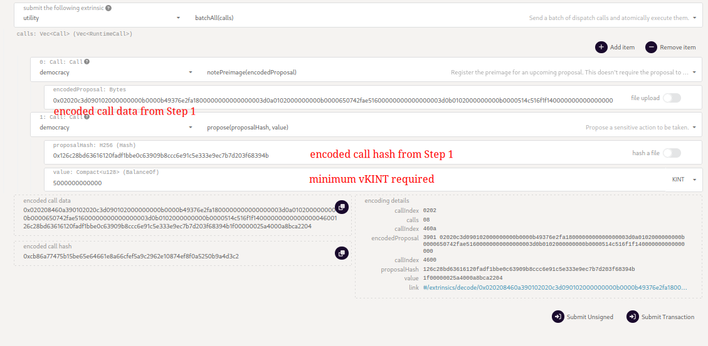

# Common Governance Proposals

## Add or Adjust Bridge Collateral Thresholds

Collateral thresholds need to be adjusted based on a `collateral` to `wrapped` basis, e.g., KSM <> KBTC or DOT <> IBTC.

There are three thresholds that can be adjusted at the same time via `utility.batchAll`. It's also possible to adjust a single threshold in a governance proposal. This instructions covers the more complex case of adjusting all thresholds at the same time.

### 1. Create the batch call to adjust the thresholds

- Go to https://polkadot.js.org/apps/#/extrinsics
- Select utlity -> batchAll
- Add three call items:

  - vaultRegistry.setSecureCollateralThreshold
  - vaultRegistry.setPremiumRedeemThreshold
  - vaultRegistry.setLiquidationCollateralThreshold

For each call select:

1. The collateral currency

  - For native assets, use `Token.Ticker`, e.g., `Token.DOT`
  - For foregin assets, use `ForeignAssets.Id`, e.g., `ForeignAsset.2` for LKSM on Kintsugi. You can find the correct foreign assets by going to https://polkadot.js.org/apps/#/chainstate -> assetRegistry -> metadata (unselect include option)

2. The wrapped currency, typically `Token.KBTC` or `Token.IBTC`
3. The new threshold. Thresholds are numbers like 1.65 = 165% encoded in a fixed type representation with 18 decimals. So a threshold of 165% would be 1.65 * 10^18 = 1,650,000,000,000,000,000.

!> Ensure that that the three thresholds are set such that secureCollateralThreshold > premiumRedeemThreshold > liquidationCollateralThreshold.

Keep this tab open for now.

#### Examples

LKSM: https://polkadot.js.org/apps/?rpc=wss%3A%2F%2Fapi-kusama.interlay.io%2Fparachain#/extrinsics/decode/0x02020c3d090102000000000b0000b49376e2fa1800000000000000003d0a0102000000000b0000650742fae51600000000000000003d0b0102000000000b0000514c516f1f140000000000000000

KSM: https://polkadot.js.org/apps/?rpc=wss%3A%2F%2Fapi-kusama.interlay.io%2Fparachain#/extrinsics/decode/0x02020c3d09000a000b0000a0d88557341600000000000000003d0a000a000b0000514c516f1f1400000000000000003d0b000a000b000002c01c870a120000000000000000

### 2. Create the proposal

Open a new browser tab.

- Go to https://polkadot.js.org/apps/#/extrinsics
- Select utlity -> batchAll
- Add two call items:

  - democracy.notePreimage

    - encodedProposal: the encoded call data from the threshold batch call in Step 1 above.

  - democracy.propose:

    - proposalHash: the encoded call hash from the threshold batch call in Step 1 above.
    - value: the [minimum vKINT/vINTR amount](guides/governance?id=required-tokens) required for making a proposal denominated in planck.

#### Examples

LKSM: https://polkadot.js.org/apps/?rpc=wss%3A%2F%2Fapi-kusama.interlay.io%2Fparachain#/extrinsics/decode/0x020208460a390102020c3d090102000000000b0000b49376e2fa1800000000000000003d0a0102000000000b0000650742fae51600000000000000003d0b0102000000000b0000514c516f1f1400000000000000004600126c28bd63616120fadf1bbe0c63909b8ccc6e91c5e333e9ec7b7d203f68394b1f00000025a4000a8bca2204

KSM: https://polkadot.js.org/apps/?rpc=wss%3A%2F%2Fapi-kusama.interlay.io%2Fparachain#/extrinsics/decode/0x020208460a150102020c3d09000a000b0000a0d88557341600000000000000003d0a000a000b0000514c516f1f1400000000000000003d0b000a000b000002c01c870a1200000000000000004600aa254fd7bc66a221ddd4d11ef8543bf8b6848bd67e3618246b18b54aaee7ff5f0b005039278c04

