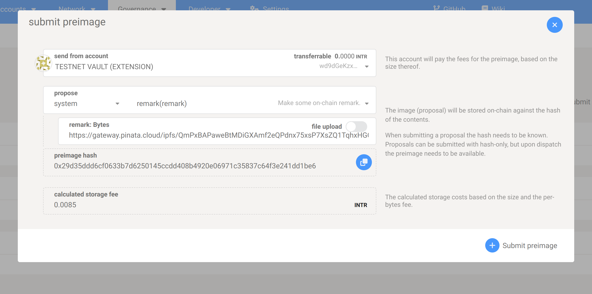
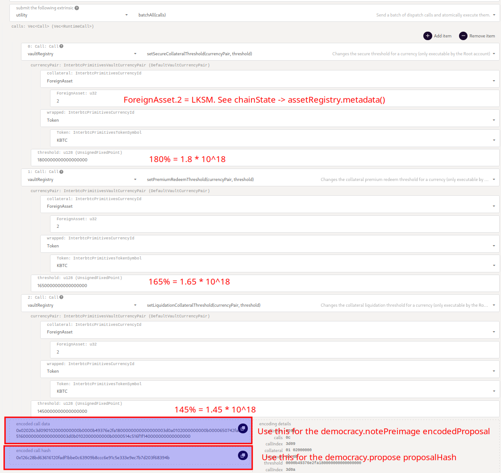
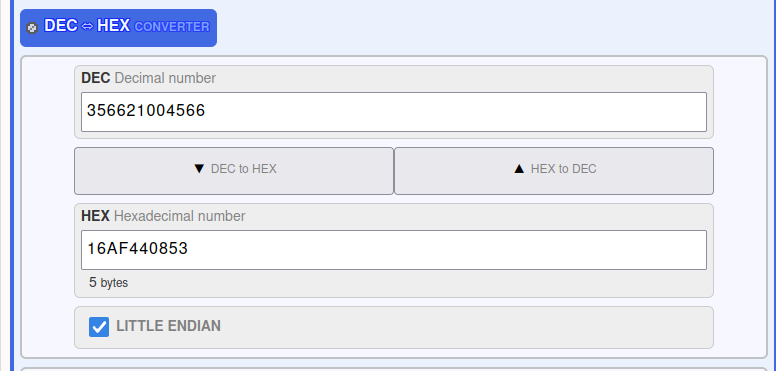
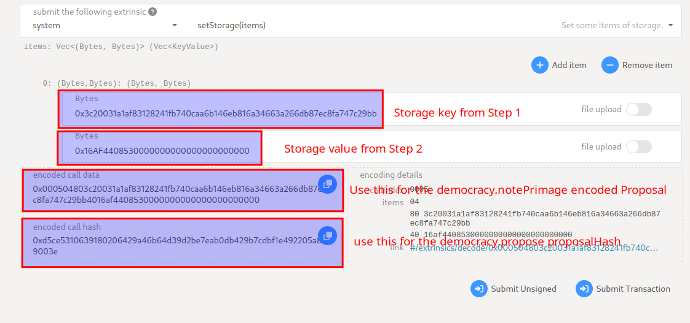
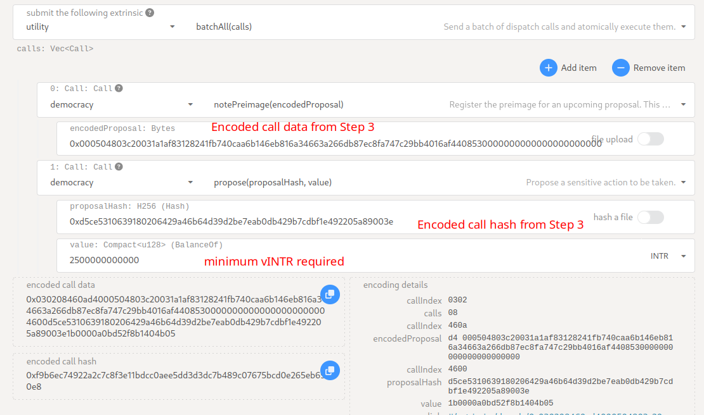

# Common Governance Proposals

## Pre-approve a future course of action

If you want to make governance pre-approving some future course of action (i.e, **no on-chain effects take place right now!**), the best way is to summarize the proposal in a PDF and have the community vote on "timestamping" the document on the blockchain:

1. Upload PDF to IPFS, e.g. using [https://www.pinata.cloud/](https://www.pinata.cloud/) 
2. Fetch the file URL (e.g. [https://gateway.pinata.cloud/ipfs/QmPxBAPaweBtMDiGXAmf2eQPdnx75xsP7XsZQ1TqhxHGCs](https://gateway.pinata.cloud/ipfs/QmPxBAPaweBtMDiGXAmf2eQPdnx75xsP7XsZQ1TqhxHGCs))
3. Create a proposal that creates an on-chain remark (writes some data to the chain).
 * Go to [https://polkadot.js.org/apps/#/democracy](https://polkadot.js.org/apps/#/democracy) (“Governance” tab). Make sure you are connected to the correct network
 * Click `Submit preimage`, under propose select `system` and then select `remark(remark)` from the second dropdown
 * Under `remark: Bytes` enter the message you want to write to the chain. Simply copy & paste the IPFS URL of the PDF file, e.g. [https://gateway.pinata.cloud/ipfs/QmPxBAPaweBtMDiGXAmf2eQPdnx75xsP7XsZQ1TqhxHGCs](https://gateway.pinata.cloud/ipfs/QmPxBAPaweBtMDiGXAmf2eQPdnx75xsP7XsZQ1TqhxHGCs) 
 * Submit the preimage

Sidenote: please add the following message at the top of your proposal text on Subsquare (see below):

"*This referendum, if passed, will create the following on-chain remark: <copy+pase the IPFS URL here>*"

## Add or Adjust Bridge Collateral Thresholds

Collateral thresholds need to be adjusted based on a `collateral` to `wrapped` basis, e.g., KSM <> KBTC or DOT <> IBTC.

There are three thresholds that can be adjusted at the same time via `utility.batchAll`. It's also possible to adjust a single threshold in a governance proposal. This instructions covers the more complex case of adjusting all thresholds at the same time.

### 1. Create the batch call to adjust the thresholds

- Go to https://polkadot.js.org/apps/#/extrinsics
- Select `utlity` -> `batchAll`
- Add three call items:

  - vaultRegistry.setSecureCollateralThreshold
  - vaultRegistry.setPremiumRedeemThreshold
  - vaultRegistry.setLiquidationCollateralThreshold

For each call select:

1. The `collateral` currency

  - For native assets, use `Token.Ticker`, e.g., `Token.DOT`
  - For foregin assets, use `ForeignAssets.Id`, e.g., `ForeignAsset.2` for LKSM on Kintsugi. You can find the correct foreign assets by going to https://polkadot.js.org/apps/#/chainstate -> assetRegistry -> metadata (unselect include option)

2. The `wrapped` currency, typically `Token.KBTC` or `Token.IBTC`
3. The new `threshold`. Thresholds are numbers like 1.65 = 165% encoded in a fixed type representation with 18 decimals. So a threshold of 165% would be 1.65 * 10^18 = 1,650,000,000,000,000,000.

!> Ensure that that the three thresholds are set such that secureCollateralThreshold > premiumRedeemThreshold > liquidationCollateralThreshold.

Keep this tab open for now.

#### Examples

LKSM: https://polkadot.js.org/apps/?rpc=wss%3A%2F%2Fapi-kusama.interlay.io%2Fparachain#/extrinsics/decode/0x02020c3d090102000000000b0000b49376e2fa1800000000000000003d0a0102000000000b0000650742fae51600000000000000003d0b0102000000000b0000514c516f1f140000000000000000

KSM: https://polkadot.js.org/apps/?rpc=wss%3A%2F%2Fapi-kusama.interlay.io%2Fparachain#/extrinsics/decode/0x02020c3d09000a000b0000a0d88557341600000000000000003d0a000a000b0000514c516f1f1400000000000000003d0b000a000b000002c01c870a120000000000000000

### 2. Create the proposal

Open a new browser tab.

- Go to https://polkadot.js.org/apps/#/extrinsics
- Select `utlity` -> `batchAll`
- Add two call items:

  - `democracy.notePreimage`

    - `encodedProposal`: the encoded call data from the threshold batch call in Step 1 above.

  - `democracy.propose`

    - `proposalHash`: the encoded call hash from the threshold batch call in Step 1 above.
    - `value`: the [minimum vKINT/vINTR amount](guides/governance?id=required-tokens) required for making a proposal denominated in planck.

#### Examples

LKSM: https://polkadot.js.org/apps/?rpc=wss%3A%2F%2Fapi-kusama.interlay.io%2Fparachain#/extrinsics/decode/0x020208460a390102020c3d090102000000000b0000b49376e2fa1800000000000000003d0a0102000000000b0000650742fae51600000000000000003d0b0102000000000b0000514c516f1f1400000000000000004600126c28bd63616120fadf1bbe0c63909b8ccc6e91c5e333e9ec7b7d203f68394b1f00000025a4000a8bca2204

KSM: https://polkadot.js.org/apps/?rpc=wss%3A%2F%2Fapi-kusama.interlay.io%2Fparachain#/extrinsics/decode/0x020208460a150102020c3d09000a000b0000a0d88557341600000000000000003d0a000a000b0000514c516f1f1400000000000000003d0b000a000b000002c01c870a1200000000000000004600aa254fd7bc66a221ddd4d11ef8543bf8b6848bd67e3618246b18b54aaee7ff5f0b005039278c04

## Update Vault Block Rewards

The Vault block rewards are distributed with the `vaultAnnuity` pallet and are controlled by the `rewardPerBlock` storage item.

Since there is no direct setter for this storage item, governance proposals need to manually overwrite the storage item to update the INTR or KINT forwarded to Vaults per block.

!> There are pitfalls here. Updating storage values requires writing to raw storage and in the worst case other parts of the parachain could be overwritten. Proceed with caution.

?> There is a fixed amount of tokens available to the annuity pallet. Setting a too high value will lead to reward depletion.

### 1. Storage Key: Get the system rewards per block key

- Go to https://polkadot.js.org/apps/?rpc=wss%3A%2F%2Fapi.interlay.io%2Fparachain#/chainstate
- `vaultAnnuity` -> `rewardPerBlock`
- Note down the encoded storage key

### Example

!> DO NOT use this storage unless you verified that it is the current correct storage key for the network you wish to make the prposal for on the live network. Storage keys might change.

### 2. Storage Value: Represent the desired rewards in hex

1. Decide what the new block reward should be in INTR or KINT per block.
2. Convert the INTR or KINT to their planck denomination.
3. Convert the INTR or KINT planck into a little endian encoded hex.
4. Pad the hex representation to be 16 bytes.

#### Example

1. New desired INTR per block: `35.6621004566` INTR
2. Planck representation: 35.6621004566 * 10^10 = `356,621,004,566`
3. Little endian hex: `0x16AF440853` ([online hex converter](https://www.save-editor.com/tools/wse_hex.html))
4. Padding added to 16 bytes: `0x16AF4408530000000000000000000000`

### 3. Create the set storage call

- Go to https://polkadot.js.org/apps/?rpc=wss%3A%2F%2Fapi.interlay.io%2Fparachain#/extrinsics
- `system` -> `setStorage`

  - `Bytes`: the storage key determined in Step 1
  - `Bytes`: the storage value determined in Step 2

Keep this tab open for now.

#### Example

Update to 35.6621004566 INTR per block:
https://polkadot.js.org/apps/?rpc=wss%3A%2F%2Fapi.interlay.io%2Fparachain#/extrinsics/decode/0x000504803c20031a1af83128241fb740caa6b146eb816a34663a266db87ec8fa747c29bb4016af4408530000000000000000000000

### 4. Create the proposal

!> At this point, be 100% confident that the proposal sets the right storage value to the right storage key.

Open a new browser tab.

- Go to https://polkadot.js.org/apps/#/extrinsics
https://polkadot.js.org/apps/?rpc=wss%3A%2F%2Fapi.interlay.io%2Fparachain#/extrinsics/decode/0x030208460ad4000504803c20031a1af83128241fb740caa6b146eb816a34663a266db87ec8fa747c29bb4016af44085300000000000000000000004600d5ce5310639180206429a46b64d39d2be7eab0db429b7cdbf1e492205a89003e1b0000a0bd52f8b1404b05Update to - Select `utlity` -> `batchAll`
- Add two call items:

  - `democracy.notePreimage`

    - `encodedProposal`: the encoded call data from Step 3 above.

  - `democracy.propose`

    - `proposalHash`: the encoded call hash from Step 3 above.
    - `value`: the [minimum vKINT/vINTR amount](guides/governance?id=required-tokens) required for making a proposal denominated in planck.

#### Example

Update to 35.6621004566 INTR per block:
https://polkadot.js.org/apps/?rpc=wss%3A%2F%2Fapi.interlay.io%2Fparachain#/extrinsics/decode/0x030208460ad4000504803c20031a1af83128241fb740caa6b146eb816a34663a266db87ec8fa747c29bb4016af44085300000000000000000000004600d5ce5310639180206429a46b64d39d2be7eab0db429b7cdbf1e492205a89003e1b0000a0bd52f8b1404b05
