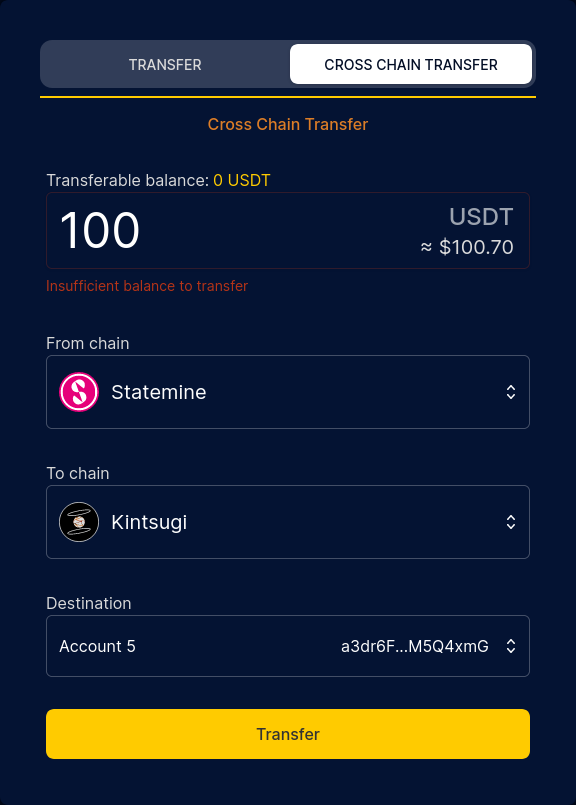
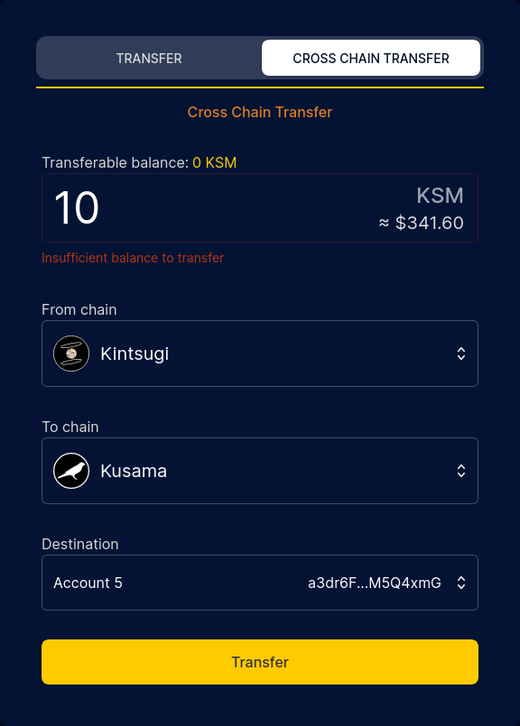

# Transfer Guide

?> You need to keep a very small amount of INTR or KINT (0.000,000,1 INTR/0.000,000,001 KINT or 1000 planck INTR/KINT) in your account as existential deposit.

?> You can only transfer tokens that have unlocked! `Available for transfer` = `free` - `frozen`

## Using the App

<!-- tabs:start -->
#### **Interlay**

[https://app.interlay.io/transfer](https://app.interlay.io/transfer)

#### **Kintsugi**

[kintsugi.interlay.io/transfer](https://kintsugi.interlay.io/transfer)

#### **Testnet-Kintsugi**

[kintnet.interlay.io/transfer](https://kintnet.interlay.io/transfer)

#### **Testnet-Interlay**

[testnet.interlay.io/transfer](https://testnet.interlay.io/transfer)

<!-- tabs:end -->

### Transfer to another address

1. Go to the Transfer page on the app. Make sure you allow polkadot.js to connect to the website.
2. Select the token you would like to transfer, e.g., DOT, IBTC, INTR, KSM, KBTC, or KINT.
3. Your available balance is shown on top of the amount input field.
4. Enter the address of the recipient. This can be in any supported Polkadot address format and will automatically be converted to the Interlay/Kintsugi address format for the transfer.
5. Click "Transfer" and sign the extrinsic to make a transaction.

### Cross chain transfers

?> At present we support transferring KSM between Kusama and Kintsugi, DOT between Polkadot and Interlay and USDT between Statemine/Statemint and Kintsugi/Interlay.

<!-- tabs:start -->
#### **Interlay**

[https://app.interlay.io/transfer?tab=crossChainTransfer](https://app.interlay.io/transfer?tab=crossChainTransfer)

#### **Kintsugi**

[https://kintsugi.interlay.io/transfer?tab=crossChainTransfer](https://kintsugi.interlay.io/transfer?tab=crossChainTransfer)

<!-- tabs:end -->

#### To Interlay/Kintsugi

Click to view cross chain transfer

0. To transfer any token to Interlay/Kintsugi, please make sure that you do have a sufficient balance on the origin chain to pay for transaction fees.
1. Make sure you select the correct account from the account selector at the top of the page. This is the account from which the transfer will be made.
2. Your available balance on the relay chain (Polkadot or Kusama) or other parachain is shown above the amount field. This will be different from the parachain balance shown at the top of the page.
3. Set the "from" chain value to the chain you want to send the funds from and the "to" chain value to Interlay or Kintsugi.
4. Select an account from the destination select field. You can only transfer to accounts that are in your wallet. If you want to transfer using the same account, make sure that the destination account matches the account selector at the top of the page.
5. Click "Transfer" and sign the extrinsic to make a transaction.
6. After the transfer has been made, if you select the account/wallet that has received the token from the account selector, then the top right token balance should be updated to include the amount of tokens transferred.

#### From Interlay/Kintsugi

Click to view cross chain transfer

0. To transfer any token from Interlay/Kintsugi, please make sure that you do have a sufficient balance of INTR/KINT to pay for transaction fees.
1. Make sure you select the correct account from the account selector at the top of the page. This is the account from which the transfer will be made.
2. Your available balance on Interlay/Kintsugi is shown above the amount field. This will be the same as the token balance shown at the top of the page.
3. Set the "from" chain value to Interlay or Kintsugi and the "to" chain value to the chain you want to send the tokens to.
4. Make sure you are transferring enough funds to cover the transfer fees and maintain the existential balance. You should see an error message below the amount field if the amount you are transferring is too low.
5. Select an account from the destination select field. You can only transfer to accounts that are in your wallet. If you want to transfer using the same account, make sure that the destination account matches the account selector at the top of the page.
6. Click "Transfer" and sign the extrinsic to make a transaction.
7. After the transfer has been made, your available token balance at the top of the page should decrease by the amount that has been transferred. If you want to check your balance on the target chain, you can do this on [Subscan](https://www.subscan.io/), but you can also set the "from" chain value to Polkadot/Kusama (as if you were making a transfer in the other direction) to see the updated balance above the amount field. This may not update immediately, and you may need to refresh the page to see the current balance.

#### How to send USDT to Interlay/Kintsugi
1. Ensure you have USDT in Statemint (Polkadot) or Statemine (Kusama) - see the Polkadot official guide on [how to get USDT from Bitfinex](https://support.polkadot.network/support/solutions/articles/65000181634-how-to-withdraw-usdt-from-bitfinex-on-statemine)
2. Follow the guide on how to transfer funds [To Interlay/Kintsugi](#to-interlaykintsugi)
3. (Optional) To check your USDT balance on Statemint or Statemine you can follow the first steps of the Polkadot official guide on [How to Transfer Tether (USDT) on Statemine](https://support.polkadot.network/support/solutions/articles/65000181118)

## Polkadot.js Developer Tab (Advanced)

Click to expand

#### Transfer KINT in Developer > Extrinsics > Tokens

?> Important: At the end of the transfer, write down / store the block hash of your transaction! (see [Step 3 below](kintsugi/guides?id=_3-transfer-kint-in-developer-gt-extrinsics-gt-tokens)). **Do not close the browser / tab before you do this!** Otherwise you will need to manually find your transaction in Polkadot.js.

1. To transfer KINT, select "Extrinsics" in the "Developer".

2. In the dropdown, select the "tokens" pallet.

3. Select the `transfer()` function. If you want to transfer all available tokens, you can use `transferAll()` - but be careful!

?> Important: You need to use `transfer()`, not `forceTransfer()`. Otherwise you will get a `BadOrigin` error.

4. Enter the source account.

5. Enter the destination account.

6. Select "KINT" in the "Token" dropdown.

7. Enter the amount **in pico KINT (1 KINT = 1,000,000,000,000 pico KINT)**.

8. Press "Sign Transaction". In the opened modal, enter your account password, and then click "Sign and Submit".

You will see a green success message after 10-20 seconds in the top right if the transfer was successful.

?> Reminder: 1 KINT = 1,000,000,000,000 pico KINT (12 zeroes).

